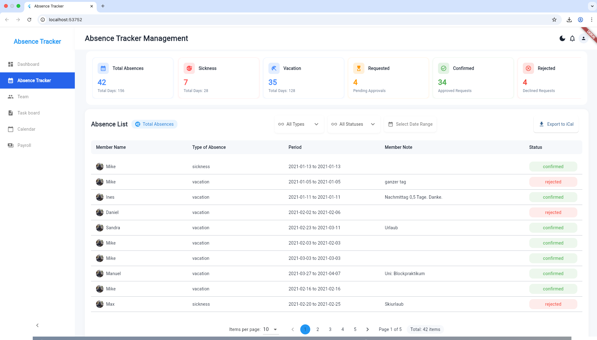
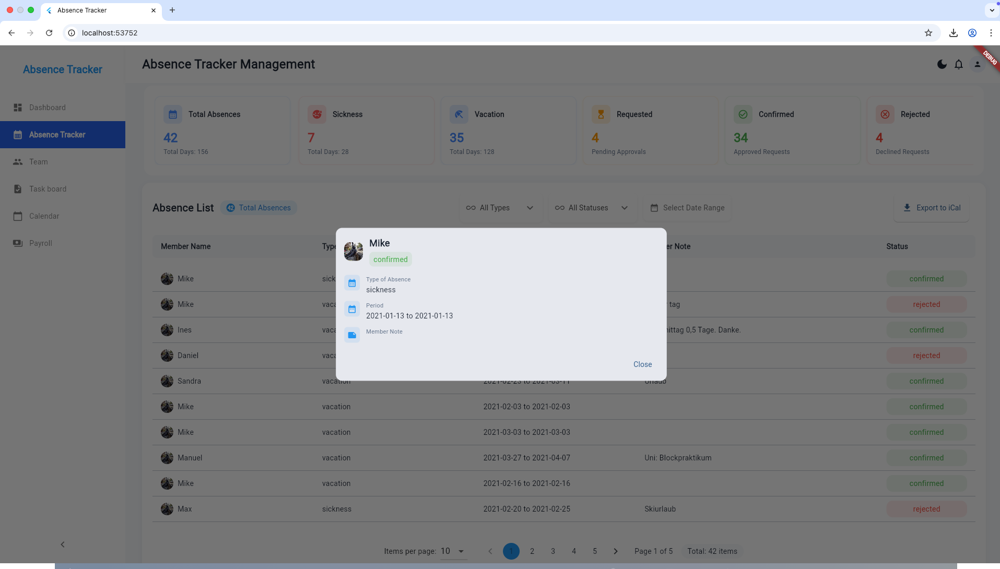
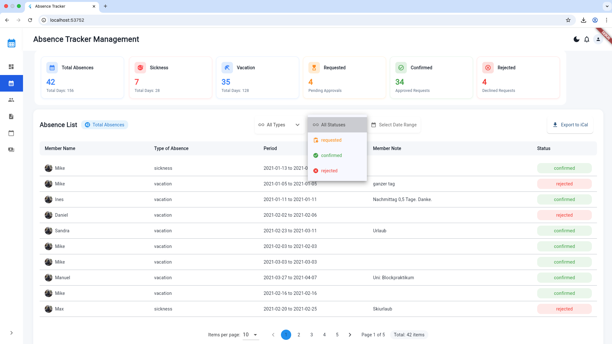
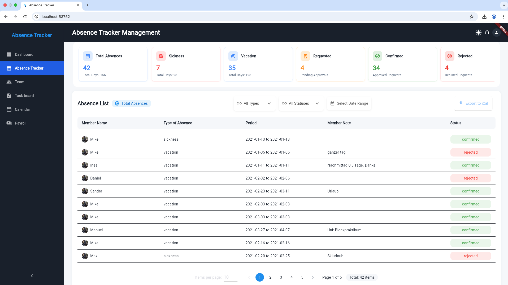

# Absence Tracker Flutter

<div align="center">


[](https://pub.dev/packages/very_good_analysis)

A modern, feature-rich absence management system built with Flutter.

[Key Features](#key-features-) •
[Live Demo](#live-demo-) •
[Getting Started](#getting-started-) •
[Installation](#installation-) •
[Architecture](#architecture-) •
[Testing](#testing-)

</div>

## Key Features 📱

- 👥 **Comprehensive Absence List**
  - View employee names and their absence details
  - Paginated view with 10 absences per page
  - Total absence count display
  
- 📋 **Detailed Absence Information**
  - Member name and absence type
  - Absence period
  - Member notes
  - Status tracking (Requested, Confirmed, Rejected)
  - Admitter notes when available

- 🔍 **Advanced Filtering**
  - Filter by absence type
  - Filter by date range
  - Real-time filter application

- 💫 **Enhanced User Experience**
  - Loading state indicators
  - Error state handling
  - Empty state messaging
  - Responsive and intuitive interface

- 📅 **Calendar Integration**
  - iCal file generation
  - Outlook calendar import support

## Live Demo 🌐

Experience the application in action! The project is deployed using GitHub Pages CI/CD pipeline.

**[Visit Live Demo](https://iabhishek3.github.io/absence_tracker_flutter/)**

### Continuous Integration/Continuous Deployment

This project uses GitHub Actions for automated deployment to GitHub Pages. The CI/CD pipeline:

1. **Triggers**:
   - On push to main branch
   - On pull request to main branch
   - Manual workflow dispatch

2. **Pipeline Steps**:
   - Sets up Flutter environment
   - Installs dependencies
   - Runs tests
   - Builds web application
   - Deploys to GitHub Pages

3. **Deployment Process**:
   ```yaml
   - Uses Flutter version: 3.27.3
   - Builds web app: flutter build web
   - Base href: /absence_tracker_flutter/
   - Deploy directory: build/web
   ```

4. **Automatic Updates**:
   - Live demo automatically updates on successful merges to main
   - Deployment status visible in GitHub Actions tab
   - Each deployment creates a new release version

The live demo showcases all the features mentioned above and is automatically updated with the latest changes from the main branch.

## Getting Started 🚀

### Prerequisites

Required development tools and versions:

- Flutter SDK (Channel stable, 3.27.3)
- macOS 15.3.1 or higher
- Android SDK (version 33.0.1)
- Xcode 16.3 or higher (for iOS/macOS development)
- Android Studio (version 2022.1)
- VS Code (version 1.99.3)
- Chrome (for web development)

All development dependencies should be properly configured. Verify your setup by running:
```bash
flutter doctor
```

### Installation

1. Clone the repository:
```bash
git clone https://github.com/iabhishek3/absence_tracker_flutter
cd absence_tracker_flutter
```

2. Install dependencies:
```bash
flutter pub get
```

4. Run the web app:
```bash
# Run in debug mode
flutter run -d chrome

# Build for production
flutter build web
```

## Installation ⚙️

1. Clone the repository:
```bash
git clone https://github.com/yourusername/absence_tracker_flutter.git
cd absence_tracker_flutter
```

2. Install dependencies:
```bash
flutter pub get
```

3. Enable web support (if not already enabled):
```bash
flutter config --enable-web
```

4. Run the web app:
```bash
# Run in debug mode
flutter run -d chrome

# Build for production
flutter build web
```

## Architecture 🏗️

This project follows Clean Architecture principles with BLoC pattern:

```
lib/
  ├── core/           # Core functionality, utilities, and constants
  ├── data/           # Data layer (repositories, models, data sources)
  ├── domain/         # Business logic and entities
  ├── presentation/   # UI layer (widgets, screens, cubits)
  └── main.dart       # Entry point
```

### Clean Architecture Diagram

Below is a visual representation of the Clean Architecture principles followed in this project:

<div align="center">
  
</div>


### State Management
- BLoC/Cubit pattern for state management
- Repository pattern for data handling
- Dependency injection using GetIt

### Dependencies

Key packages used in this project:
- `flutter_bloc`: State management
- `get_it`: Dependency injection
- `dio`: HTTP client
- `freezed`: Code generation
- `json_serializable`: JSON serialization

## Testing 🧪

### Code Coverage

Current test coverage: 24.0% (265 of 1106 lines)

#### Well Tested Components (>80% coverage)
- `absence_stats.dart`: 98.2% (112/114 lines)
- `absence_model.dart`: 100% (36/36 lines)
- `absence_model.g.dart`: 100% (28/28 lines)
- `absence_repository_impl.dart`: 96% (24/25 lines)
- `member_model.g.dart`: 100% (14/14 lines)

#### Areas Needing More Tests (<50% coverage)
- `absence_cubit.dart`: 0% (0/153 lines)
- `absence_filters.dart`: 0% (0/109 lines)
- `absence_list.dart`: 1.1% (2/185 lines)
- `layouts/`: 0% (0/147 lines)

### Running Tests

```bash
# Run all tests
flutter test

# Run tests with coverage
flutter test --coverage

# Generate coverage report
genhtml coverage/lcov.info -o coverage/html
```

View the coverage report at `coverage/html/index.html`

## 📞 Support

For support and inquiries:

- ✉️ Email: [abhishek.111002@gmail.com](mailto:abhishek.111002@gmail.com)
- 💼 LinkedIn: [Abhishek Kumar](https://www.linkedin.com/in/iabhishek-kumar/)
- 💬 Join our Slack channel

## 📸 Screenshots

<div align="center">
<table>
  <tr>
    <td>Absence List View</td>
    <td>Loading State</td>
    <td>Statistics View</td>
    <td>Filter Options</td>
  </tr>
  <tr>
    <td></td>
    <td></td>
    <td></td>
    <td></td>
  </tr>
</table>
</div>

---

<div align="center">
Made with ❤️ by <a href="https://www.linkedin.com/in/iabhishek-kumar/">Abhishek Kumar</a>
</div>
